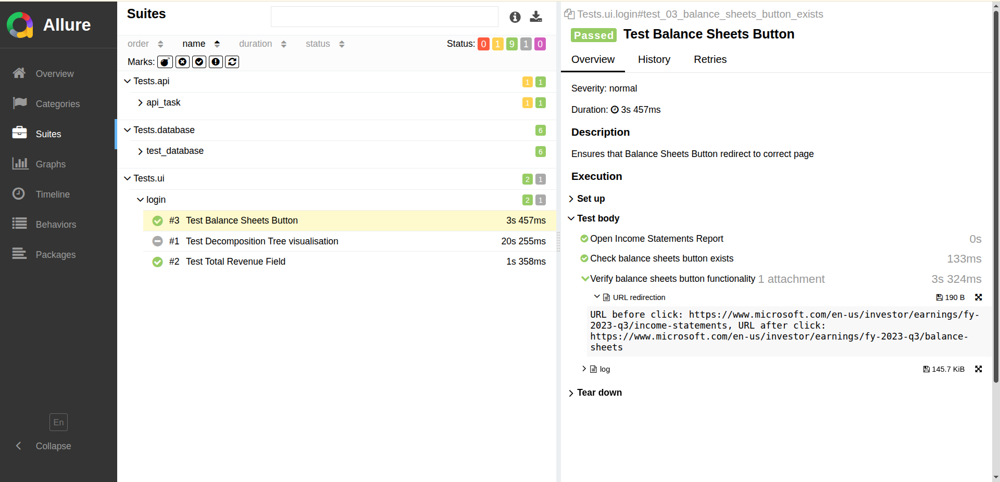

# python-test-automation-framework
Multi-layer test automation: Database, API, UI with Pytest, Allure reporting &amp; YAML configs

[//]: # (For project structure consider framework  [DQE_LAB_2024]&#40;https://github.com/AntonLazarchik/DQE_LAB_2024&#41;)

[//]: # ()
[//]: # (- Unit test taken from [PR#65]&#40;https://github.com/KarynaOhol/Karyna_Ohol_SP25/pull/65&#41;)

[//]: # (  `Task 3: Database Testing Framework with Allure Reporting`)

[//]: # ()
[//]: # (- Integration tests [PR#68]&#40;https://github.com/KarynaOhol/Karyna_Ohol_SP25/pull/68&#41;)

[//]: # (  `Task 1 : API testing with JSONPlaceholder and Cloud storage validation`)


### Framework Structure

```
testing_framework/
│
├── README.md
├── requirements.txt
├── pytest.ini
├── conftest.py                    # Allure environment configuration
├── run_all_tests.py              # Master test runner with Allure integration
├── allure-results/               # Allure raw results
├── allure-report/                # Generated HTML report
│   └──index.hml
│
├── Configs/
│   ├── config_SQL_tests.yaml      # Database queries configuration
│   └── config_selenium.yaml     # UI/Selenium configuration
│
├── Tests/
│   ├── __init__.py
│   │
│   ├── database/
│   │   ├── __init__.py
│   │   ├── conftest.py          # Database-specific fixtures
│   │   └── test_database.py
│   │
│   ├── api/
│   │   ├── __init__.py
│   │   ├── conftest.py          # API-specific fixtures
│   │   └── api_task.py          # API integration tests
│   │
└── └── ui/
        ├── login.py           # UI/Selenium tests
        └── Pages/
           ├── __init__.py
           └── income_statements_page.py
```

#### Working with Microsoft Income Statements report - new functionality to framework

Report represent web page [Microsoft Income Statements report](https://www.microsoft.com/en-us/investor/earnings/fy-2023-q3/income-statements)

for **UI testing exist 3 tests**:

- `test_01_open_decomposition_tree_visualization` - test from template marked as FAILED as Power BI tab not available on
  current page

New functional test that refer to existed locators represented on a page

- `test_02_total_revenue_field_exists_and_clickable`
- `test_03_balance_sheets_button_exists`


---

Database test in final suit 


UI Tests also added to Allure report




Api test in final suit 

